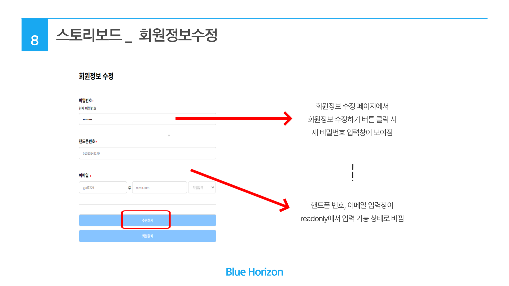

# 김태영 BLUE HORIZON

 
:pushpin: 사용법 : DB생성 파일에서 CREATE , INSER 참고하여 실행.
>BLUE HORIZON 홈페이지(팀 프로젝트)   
>개발 기간 : 23.11.14 ~ 23.11.29 (15일) 
>   
>개발 환경:   
> html, css, js, java, jquey, jsp, tomcat9, mybatis, json, jsp, Spring, Git, sourcetree, 
	mysql, IntelliJ IDEA, Visual Studio Code 

## :pushpin: Projects
 ###  [BLUE HORIZON](https://drive.google.com/file/d/1Aqk8rdy-Go0vhdKua8hBnC3ZLcbxmKp8/view?usp=drive_link)  pdf 바로보기

## :pushpin: 내가 맡은 기능 소개 
    -후기 게시판 , 마이페이지-

 

## :pushpin: Contact
- 이메일: kty991213@naver.com
- 깃헙: https://github.com/taeyoungkim1213

 

